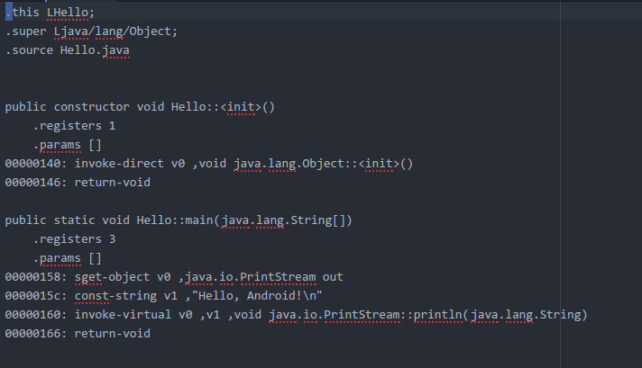

### About

bakksmali is a python tool that can transfrom dex file to smali text.And it's forked form the dex parser writed by yanfeng.wyf.It still has some problems.

### Usage

```py
python bakksmali.py dex_file
```

### Screenshot


